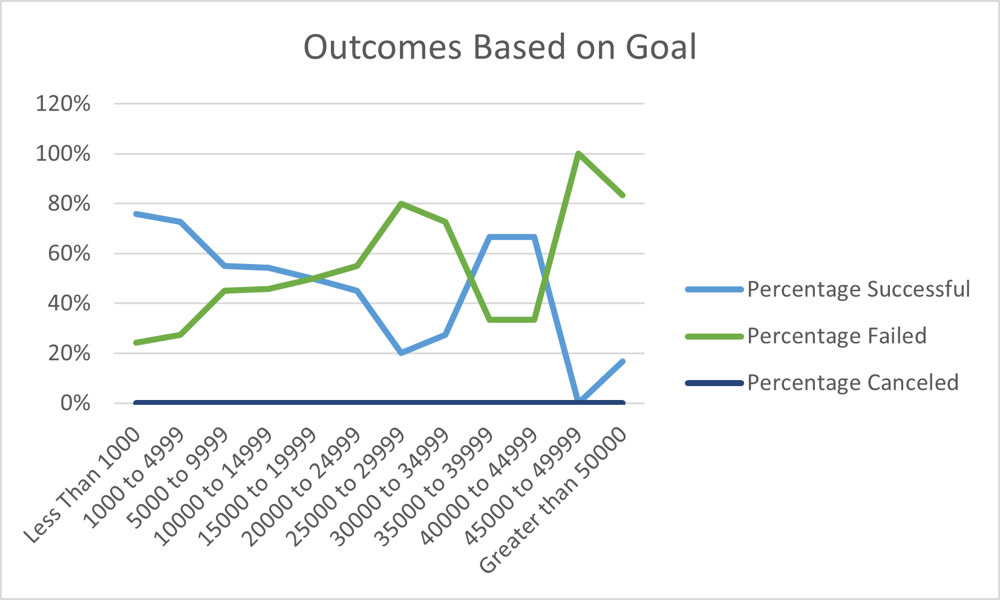

# Kickstarter
Module 1 Analyzing Kickstarter
# Kickstarting with Excel

## Overview of Project

### Purpose
The purpose of the analysis was to find out how well plays did based on their launch dates and funding goals. We analyzed these projects using excel and various methods of filtering the data to narrow down the information to plays, when they were launched, and how much they raised to fulfill the project.

## Analysis and Challenges

### Analysis of Outcomes Based on Launch Date
The first goal was to analyze the data based on launch date. We wanted to know how successful theaters were based on when their shows were released. Pivot tables were utilized to break down the information by year and type of entertainment (theater) then we charted which projects were successful, failed, or canceled (See Figure 1).

### Analysis of Outcomes Based on Goals

In order to find outcomes based on goal, we used goal markers and the “countifs” function on excel to find exactly how many projects succeeded, failed, or were canceled based on the goal amount, again filtering by plays (See Figure 2). 

### Challenges and Difficulties Encountered
Challenges included learning new functions in order to analyze data and retrieve specific data from a large data set. The large data set also provided a challenge in making charts. It was necessary to create multiple worksheets to narrow down the data set to the exact data we needed in order to create an appropriate chart and visualize the necessary data in a meaningful way. 

## Results

- What are two conclusions you can draw about the Outcomes based on Launch Date?
The most successful plays occurred in May. There was a steady amount of canceled shows throughout the year, with no particular month having more or less canceled shows. 
- What can you conclude about the Outcomes based on Goals?
As goals become higher, the percentage of failed plays increases. Lower, more achievable goals had higher rates of success. 
- What are some limitations of this dataset?
There is a lot of information from a variety of countries, avenues of entertainment, monetary goals, etc. that it is necessary to really narrow down the data you want. If you look at only plays across all countries, you get such a wide range of results that it does not necessarily give you important information. However, if you were to look at only plays in the US, or only video games in Great Britain, you narrow down your search enough to find meaninful data. While this is a great exercise for learning how to filter data in excel, it lacks the ability to draw meaningful conclusions based on a specific area at a specific time. 
- What are some other possible tables and/or graphs that we could create?
We could look at a bar graph based on successful plays (or some other entertainment medium) in each country AND launch date so we could see if there is a difference in the success based on the month it was launched in from place to place. The weather is different all over the world so while more people may be going to plays from May to September in the US and Great Britain, they could be more popular from October to February in Australia. 

## Figures
###Figure 1

###Figure 2

